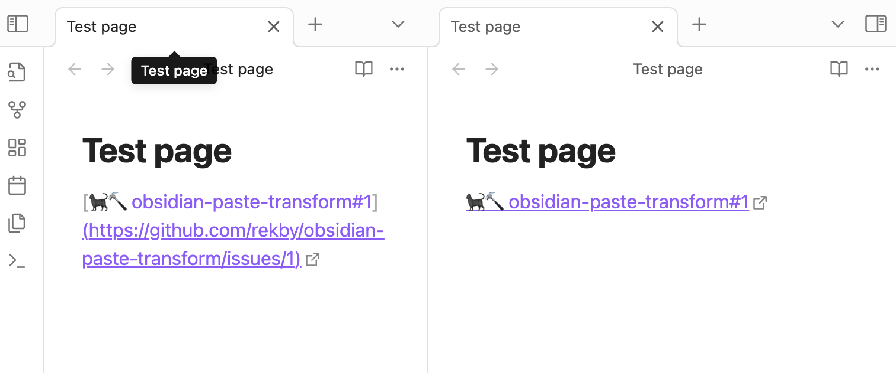

# Paste transform plugin

This is a Paste transform plugin for Obsidian (https://obsidian.md).

The plugin handle paste event, check if pasted simple text, then handle pasted text by regexp or script.

I use it for short links for issues/prs and expand issues to internal issue tracker.
For example: ASD-123 -> `[ASD-123](https://internal.tracker/ASD-123)`

# Usage 
Simple paste text/link from clipboard. For example try to copy and paste link for [example issue](https://github.com/rekby/obsidian-paste-transform/issues/1)
and paste them to a page.



# Settings


## Transform rules
Each rule contains of regex to match and replacer. 
Replacer can be either regex replacer or a script.
Use regex replacer for simple tasks. 

You can read more about regexp at [javascript documentation](https://developer.mozilla.org/en-US/docs/Web/JavaScript/Guide/Regular_expressions).
You can read more about replacement string at [javascript documentation](https://developer.mozilla.org/en-US/docs/Web/JavaScript/Reference/Global_Objects/String/replace#specifying_a_string_as_the_replacement).

The plugin contains some default rules for GitHub and Wikipedia as example. 

### JavaScript execution rules
You can also create rules that execute JavaScript code. To do this, select "Script Replacer" from the dropdown menu when creating a new rule.

The JavaScript code will receive a `match` object (the result of `string.match(regexp)`). The code should return the replacement string.

The code can be asynchronous (using `await`) and can make HTTP requests (using `fetch`). You don't need to manually wrap your code in an async function - the plugin will automatically handle this for you.

Example of a async script rule:
```javascript
// Example of an async HTTP request
const url = 'https://httpbin.org/get?input=' + encodeURIComponent(match[1]);
const response = await fetch(url);
const data = await response.json();
return data.url;
```
For simple transformations that don't require asynchronous operations, you can write synchronous JavaScript code:

```javascript
// Simple string manipulation
return match[1].toUpperCase();
```

## Try result
You can write test text into "Try source" text area and see result in "Try destination".
If you make a mistake in regexp - error will output to "Try destination"

## Resize text area
Text areas can be small by default. You can resize them by drag at right down corner.

## Installation

Install from Obsidian Community Plugins: https://obsidian.md/plugins?id=paste-transform

### Manual Installation

1. Download the `.zip` file from the [latest release](https://github.com/rekby/obsidian-paste-transform/releases).
2. Unzip into: `{VaultFolder}/.obsidian/plugins/`
3. Reload obsidian

# Versioning
Current version system is 0.X.Y, where X changed when update contains some incompatible changes (see in release notes).
Y changes for updates without incompatible changes (bug fix, add new features, etc.).
